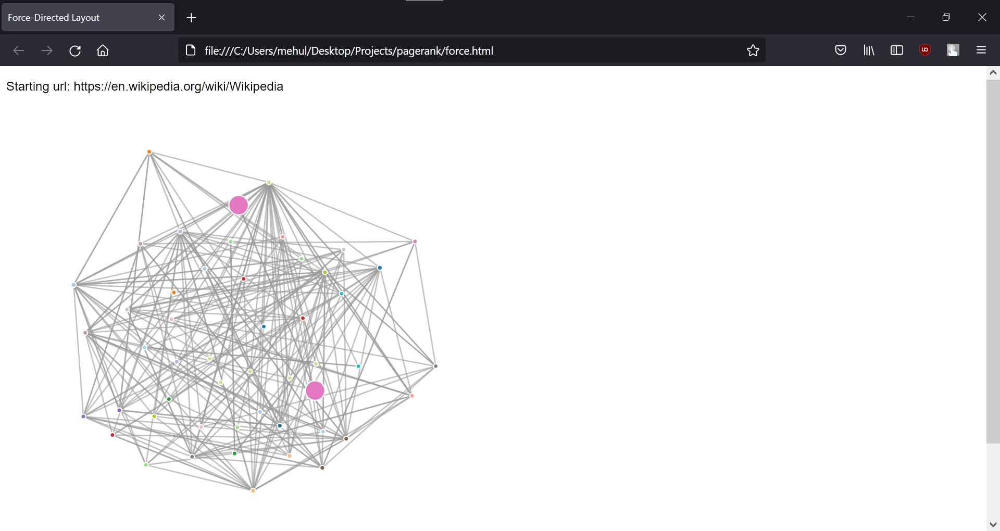

# Web Crawler and PageRanker

 

## Features

- A Web Crawler that gets links between pages of website and store them in a SQL database. Web crawler doesn't recrawl any pages already in the database

- PageRank Algorithm is applied to the gathered databases of links and D3.js is used to visualize top N webpages with the highest pageranks

- Pageranks can be recalculated without having to recrawl through webpages

## Setup and Installation

To install the package and all dependencies:

```
git clone https://github.com/mehulsinha73/pagerank.git
conda create -n pagerank requirements.txt
conda activate pagerank
```

## Running the program

- To activate web crawler, run given command and enter URL

```
python spider.py
```

- To get Page Ranks, run given command and enter Page Rank iterations

```
python sprank.py
```

- To reset Page Rank calculations, run given command

```
python spreset.py
```

- Run `spjson.py` to convert SQL to json for `force.html` and enter no. of nodes

```
python spjson.py
```

- Open `force.html` in a browser to view the visualization
